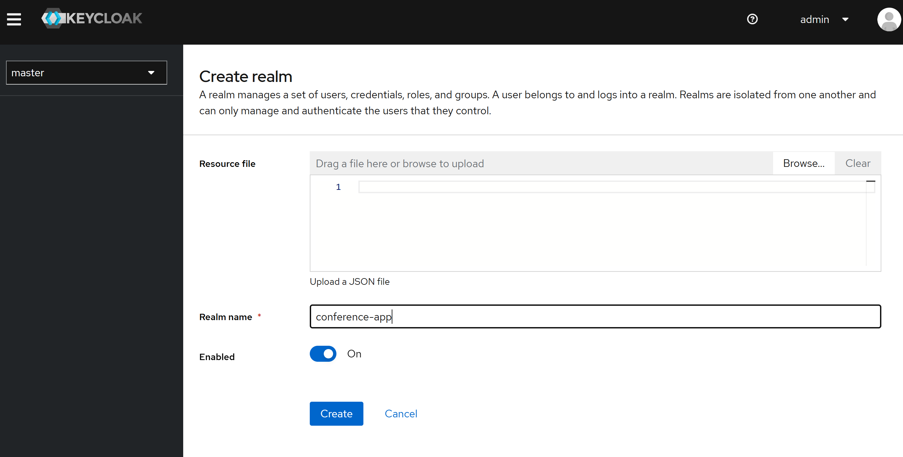
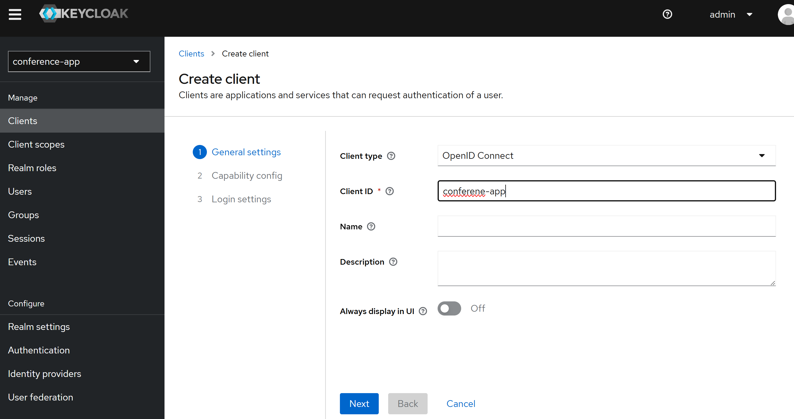
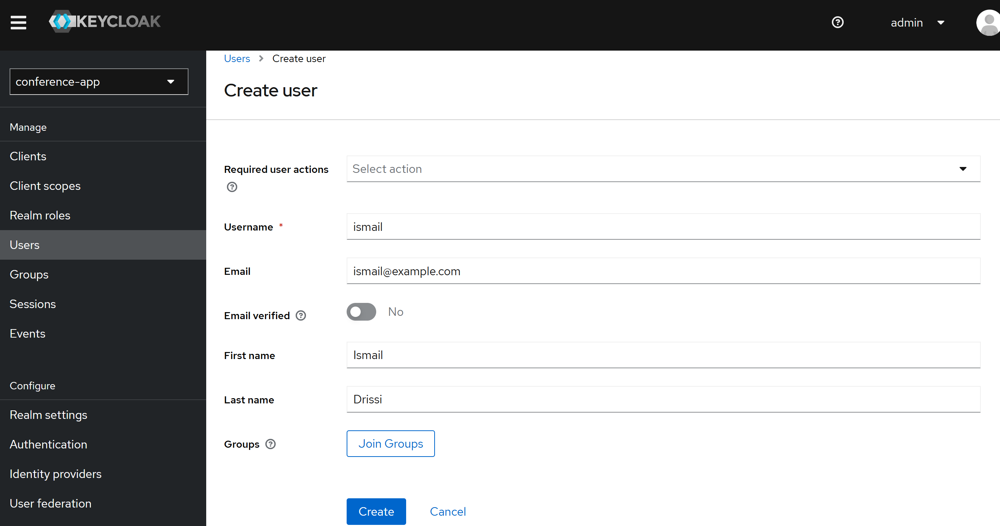
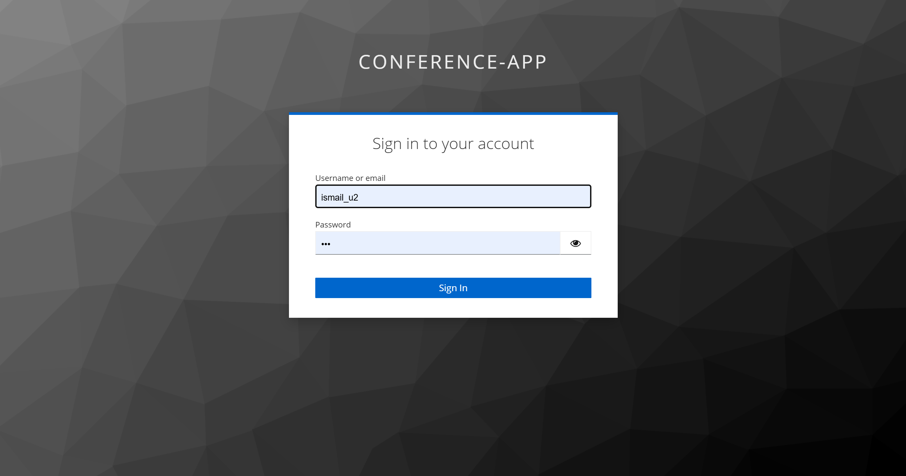
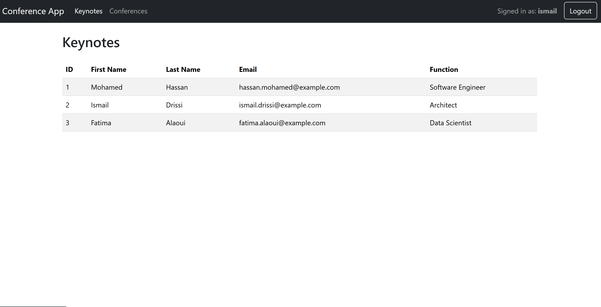
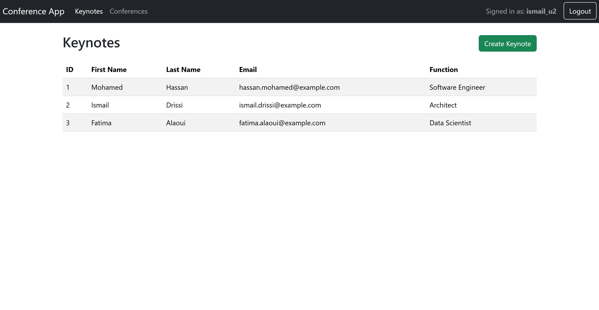
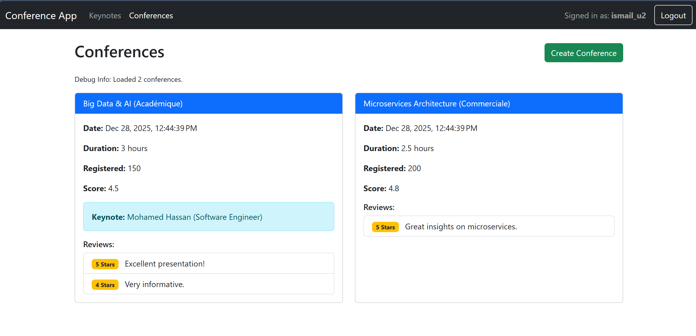

# Microservice Architecture Activity 4

## Overview

This project implements a comprehensive Microservice Architecture for managing Conferences and Keynotes. It leverages the **Spring Boot** ecosystem for backend microservices, **Spring Cloud** for distributed system patterns (Configuration, Discovery, Gateway), and **Angular** for a responsive frontend.

Security is a primary focus, implemented using **OAuth2** and **OIDC** protocols via **Keycloak**. The application enforces **Role-Based Access Control (RBAC)** to differentiate between standard users and administrators.

## Architecture Diagram


## System Components

The system consists of the following logically separated components:

1.  **Config Service (Port 8091)**: Centralized configuration server backed by Git.
2.  **Discovery Service (Port 8761)**: Eureka Service Registry for dynamic service registration and discovery.
3.  **Gateway Service (Port 8090)**: Spring Cloud Gateway acting as the single entry point for routing API requests.
4.  **Keynote Service (Port 8081)**: Resource Server managing Keynote speaker data.
5.  **Conference Service (Port 8082)**: Resource Server managing Conferences and Reviews. It communicates securely with the Keynote Service via OpenFeign.
6.  **Angular Frontend (Port 4200)**: A modern web interface for users and admins.
7.  **Keycloak (Port 8080)**: Identity Provider (IdP) handling Authentication and Authorization.

## Project Structure

```bash
.
├── README.md                  # Project Documentation
├── angular-front-app          # Angular Frontend Application
├── conference-service         # Conference Microservice (Resource Server)
├── config-service             # Central Configuration Service
├── discovery-service          # Eureka Discovery Service
├── gateway-service            # API Gateway
├── keynote-service            # Keynote Microservice (Resource Server)
├── docker-compose.yml         # Container Orchestration
└── screenshots                # Documentation Media
```

## Security & Roles

Security is enforced at multiple layers:

-   **Authentication**: Users authenticate via Keycloak (OIDC Authorization Code Flow).
-   **Authorization**: RBAC ensures only authorized roles can access specific operations.
-   **Inter-Service Security**: JWT Tokens are propagated from `Conference Service` to `Keynote Service` using a custom Feign Client Interceptor.

| Role | Permissions |
| :--- | :--- |
| **USER** | Can **view** Keynotes and Conferences. |
| **ADMIN** | Can **view** and **create** new Keynotes and Conferences. |

## Prerequisites

-   **Java 17+** (JDK)
-   **Node.js & npm** (Frontend)
-   **Docker & Docker Compose** (Containerization)

## Getting Started

### 1. Start Infrastructure (Keycloak)
Run Keycloak using Docker Compose:
```bash
docker-compose up -d keycloak
```
-   **URL**: `http://localhost:8080`
-   **Creds**: `admin` / `admin`
-   **Setup**: Create Realm `conference-app`, Client `conference-app` (Public), and roles `USER`/`ADMIN`.

### 2. Start Backend Services
You can run services individually via Maven or use Docker.

**Option A: running locally (Maven)**
```bash
# In each service directory:
./mvnw spring-boot:run
```
*Order: Config -> Discovery -> Keynote -> Conference -> Gateway*

**Option B: running with Docker**
First, build the JARs:
```bash
mvn clean package -DskipTests
```
Then start all containers:
```bash
docker-compose up --build -d
```

### 3. Start Frontend (Angular)
```bash
cd angular-front-app
npm install
ng serve
```
Access the application at `http://localhost:4200`.

## Features

-   **Microservices Pattern**: Decoupled services for scalability.
-   **Frontend Composition**: Smart data fetching in Angular to combine data from multiple sources.
-   **Secure Communication**: All API requests are authenticated using JWT Bearer tokens.
-   **Dynamic UI**: The "Create" buttons and forms are conditionally rendered based on the logged-in user's role.

## Screenshots

### Keycloak Configuration
| Creating Realm | Creating Client | Creating User |
| :---: | :---: | :---: |
|  |  |  |

### Application Views
**Login Page**


**Keynotes (User vs Admin)**
| User View | Admin View (Create Button) |
| :---: | :---: |
|  |  |

**Conferences (Admin View)**



